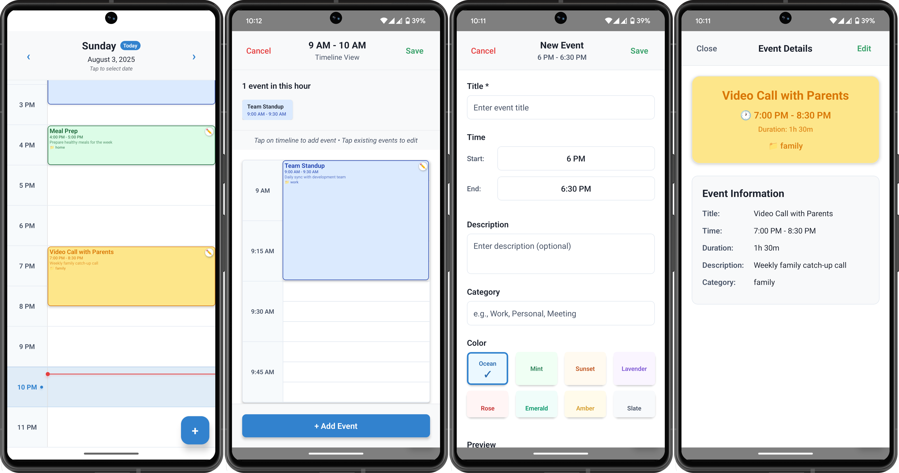
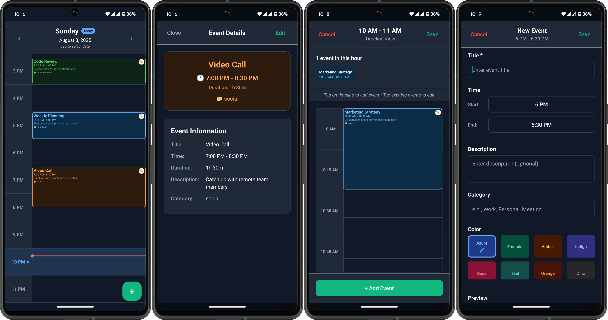

[](https://badge.fury.io/js/awesome-agenda)
[](https://www.npmjs.com/package/awesome-agenda)
[](https://opensource.org/licenses/MIT)
[](http://www.typescriptlang.org/)
[](https://reactnative.dev/)

# Awesome Agenda

A beautiful, customizable, and feature-rich agenda/calendar component for React Native applications. Perfect for scheduling apps, calendar views, and event management.

## ✨ Features

### 📅 **Core Functionality**

- **Daily Schedule View** - Clean timeline layout with hourly slots
- **Event Management** - Add, edit, delete events with intuitive UI
- **Multi-format Time Support** - 12-hour or 24-hour time formats
- **Date Navigation** - Smooth navigation between days with arrows and date picker
- **Current Time Indicator** - Real-time line showing current time (today only)

### 🎨 **Customization**

- **Fully Themeable** - Dark mode, light mode, or custom themes
- **Event Colors** - Customizable color schemes (6-8 colors recommended for optimal UX)
- **Flexible Layout** - Adjustable cell heights and grid lines
- **Custom Event Categories** - Organize events with categories

### 💫 **User Experience**

- **Floating Action Button** - Quick event creation
- **Drag-free Event Management** - Tap to view, edit, or delete
- **Overlapping Event Support** - Smart layout for multiple events at same time
- **Native Date/Time Pickers** - Platform-specific date and time selection
- **Auto-scroll** - Automatically scrolls to current hour on "today"

### 📱 **Platform Support**

- **iOS & Android** - Native components for optimal performance
- **TypeScript** - Full type safety and IntelliSense support
- **Expo Compatible** - Works with both Expo and bare React Native

## 📦 Installation

```bash
npm install awesome-agenda
```

### Dependencies

This component requires the following peer dependencies:

```bash
npm install @react-native-community/datetimepicker react-native-safe-area-context
```

For Expo projects:

```bash
expo install @react-native-community/datetimepicker react-native-safe-area-context
```

## 🚀 Quick Start

```typescript
import React, { useState } from "react";
import { AgendaScheduler, DaySchedule, ScheduleItem } from "awesome-agenda";

export default function App() {
  const [schedule, setSchedule] = useState<DaySchedule[]>([]);

  const handleScheduleChange = (newSchedule: DaySchedule[]) => {
    setSchedule(newSchedule);
    // Save to your backend/database here
  };

  return (
    <AgendaScheduler
      schedule={schedule}
      onScheduleChange={handleScheduleChange}
      timeFormat="12"
      theme={{
        backgroundColor: "#ffffff",
        headerBackgroundColor: "#f8f9fa",
        headerTextColor: "#333333",
        arrowColor: "#007bff",
      }}
    />
  );
}
```

## 📊 Data Structure

### ScheduleItem

```typescript
interface ScheduleItem {
  id: string;
  startTime: string; // "09:00" or "9:00 AM"
  endTime: string; // "10:00" or "10:00 AM"
  title: string; // "Team Meeting"
  description?: string; // Optional description
  color?: string; // Background color
  textColor?: string; // Text color
  category?: string; // "work", "personal", etc.
}
```

### DaySchedule

```typescript
interface DaySchedule {
  date: string; // "2025-08-03" (ISO format)
  dayName: string; // "Monday"
  items: ScheduleItem[];
}
```

## ⚙️ Props

| Prop            | Type                   | Default | Description                          |
| --------------- | ---------------------- | ------- | ------------------------------------ |
| `schedule`      | `DaySchedule[]`        | `[]`    | Array of day schedules               |
| `timeFormat`    | `'12' \| '24'`         | `'12'`  | Time display format                  |
| `cellHeight`    | `number`               | `80`    | Height of each hour cell             |
| `theme`         | `Partial<AgendaTheme>` | `{}`    | Custom theme overrides               |
| `showGridLines` | `boolean`              | `true`  | Show grid lines between hours        |
| `initialDate`   | `string`               | Today   | Initial date to display (ISO format) |

### Callbacks

| Callback           | Type                                          | Description                  |
| ------------------ | --------------------------------------------- | ---------------------------- |
| `onScheduleChange` | `(schedule: DaySchedule[]) => void`           | Called when schedule changes |
| `onEventAdd`       | `(event: ScheduleItem, date: string) => void` | Called when event is added   |
| `onEventEdit`      | `(event: ScheduleItem, date: string) => void` | Called when event is edited  |
| `onEventDelete`    | `(eventId: string, date: string) => void`     | Called when event is deleted |
| `onDayChange`      | `(date: string) => void`                      | Called when user changes day |

## 🎨 Theming

The component is fully customizable with a comprehensive theme system. You can override any part of the theme to match your app's design.

### Complete Theme Interface

```typescript
interface AgendaTheme {
  // Main container
  backgroundColor: string;

  // Header styling
  headerBackgroundColor: string;
  headerTextColor: string;
  arrowColor: string;

  // Timeline styling
  timeTextColor: string;
  gridLineColor: string;
  timelineBackgroundColor: string;
  timeColumnBackgroundColor: string;
  eventAreaBackgroundColor: string;

  // Current hour highlighting
  currentHourBackgroundColor: string;
  currentHourBorderColor: string;
  currentHourTextColor: string;
  currentTimeLineColor: string;

  // Floating Action Button
  fabBackgroundColor: string;
  fabIconColor: string;

  // Today indicator
  todayIndicatorBackgroundColor: string;
  todayIndicatorTextColor: string;

  // Today button
  todayButtonBackgroundColor: string;
  todayButtonBorderColor: string;

  // Modal buttons
  saveButtonColor: string;
  cancelButtonColor: string;

  // Event color options
  eventColorOptions: Array<{
    name: string;
    value: string;
    textColor: string;
  }>;
}
```

### Light Theme Example

```typescript
const lightTheme = {
  backgroundColor: "#ffffff",
  headerBackgroundColor: "#f8f9fa",
  headerTextColor: "#333333",
  arrowColor: "#007bff",
  timeTextColor: "#666666",
  gridLineColor: "#e9ecef",
  timelineBackgroundColor: "#ffffff",
  timeColumnBackgroundColor: "#f8f9fa",
  eventAreaBackgroundColor: "#ffffff",
  currentHourBackgroundColor: "rgba(0, 123, 255, 0.05)",
  currentHourBorderColor: "rgba(0, 123, 255, 0.2)",
  currentHourTextColor: "#007bff",
  currentTimeLineColor: "#ff4444",
  fabBackgroundColor: "#007bff",
  fabIconColor: "#ffffff",
  todayIndicatorBackgroundColor: "#007bff",
  todayIndicatorTextColor: "#ffffff",
  todayButtonBackgroundColor: "#f0f8ff",
  todayButtonBorderColor: "#007bff",
  saveButtonColor: "#28a745",
  cancelButtonColor: "#dc3545",
  eventColorOptions: [
    { name: "Blue", value: "#e3f2fd", textColor: "#1976d2" },
    { name: "Green", value: "#e8f5e8", textColor: "#2e7d32" },
    { name: "Orange", value: "#fff3e0", textColor: "#ef6c00" },
    { name: "Purple", value: "#f3e5f5", textColor: "#7b1fa2" },
    { name: "Red", value: "#ffebee", textColor: "#c62828" },
    { name: "Teal", value: "#e0f2f1", textColor: "#00695c" },
    { name: "Yellow", value: "#fffde7", textColor: "#f57f17" },
    { name: "Gray", value: "#f5f5f5", textColor: "#424242" },
  ],
};
```

### Dark Theme Example

```typescript
const darkTheme = {
  backgroundColor: "#1a1a1a",
  headerBackgroundColor: "#2d2d2d",
  headerTextColor: "#ffffff",
  arrowColor: "#bb86fc",
  timeTextColor: "#b3b3b3",
  gridLineColor: "#404040",
  timelineBackgroundColor: "#252525",
  timeColumnBackgroundColor: "#2d2d2d",
  eventAreaBackgroundColor: "#1e1e1e",
  currentHourBackgroundColor: "rgba(187, 134, 252, 0.1)",
  currentHourBorderColor: "rgba(187, 134, 252, 0.3)",
  currentHourTextColor: "#bb86fc",
  currentTimeLineColor: "#cf6679",
  fabBackgroundColor: "#03dac6",
  fabIconColor: "#000000",
  todayIndicatorBackgroundColor: "#bb86fc",
  todayIndicatorTextColor: "#000000",
  todayButtonBackgroundColor: "#404040",
  todayButtonBorderColor: "#bb86fc",
  saveButtonColor: "#03dac6",
  cancelButtonColor: "#cf6679",
  eventColorOptions: [
    { name: "Cyan", value: "#1a2332", textColor: "#64b5f6" },
    { name: "Green", value: "#1b2e1f", textColor: "#81c784" },
    { name: "Orange", value: "#2e2016", textColor: "#ffb74d" },
    { name: "Purple", value: "#2a1d32", textColor: "#ba68c8" },
    { name: "Red", value: "#3d1a1a", textColor: "#e57373" },
    { name: "Teal", value: "#1a2e2a", textColor: "#4db6ac" },
    { name: "Yellow", value: "#2e2a16", textColor: "#dce775" },
    { name: "Gray", value: "#2d2d2d", textColor: "#bdbdbd" },
  ],
};
```

### Custom Event Colors

You can provide your own color palette (typically 6-8 colors work best for UI):

```typescript
const customEventColors = [
  { name: "Ocean", value: "#e3f2fd", textColor: "#1565c0" },
  { name: "Forest", value: "#e8f5e8", textColor: "#2e7d32" },
  { name: "Sunset", value: "#fff3e0", textColor: "#f57c00" },
  { name: "Lavender", value: "#f3e5f5", textColor: "#7b1fa2" },
  { name: "Rose", value: "#ffebee", textColor: "#c62828" },
  { name: "Mint", value: "#e0f2f1", textColor: "#00695c" },
  // Add as many as you need
];

const customTheme = {
  // ... other theme properties
  eventColorOptions: customEventColors,
};
```

## 🛠️ Advanced Usage

### Managing Events

```typescript
const [schedule, setSchedule] = useState<DaySchedule[]>([
  {
    date: "2025-08-03",
    dayName: "Monday",
    items: [
      {
        id: "1",
        startTime: "9:00 AM",
        endTime: "10:00 AM",
        title: "Team Standup",
        description: "Daily sync with the team",
        category: "work",
        color: "#e3f2fd",
        textColor: "#1976d2",
      },
    ],
  },
]);

const handleEventAdd = (event: ScheduleItem, date: string) => {
  // Send to your API
  console.log("New event:", event, "on", date);
};
```

### Integration with Backend

```typescript
const AgendaWithBackend = () => {
  const [schedule, setSchedule] = useState<DaySchedule[]>([]);

  const handleScheduleChange = async (newSchedule: DaySchedule[]) => {
    setSchedule(newSchedule);

    // Save to backend
    try {
      await api.saveSchedule(newSchedule);
    } catch (error) {
      console.error("Failed to save schedule:", error);
    }
  };

  const handleDayChange = async (date: string) => {
    // Load events for specific date
    try {
      const dayEvents = await api.getEventsForDate(date);
      // Update schedule...
    } catch (error) {
      console.error("Failed to load events:", error);
    }
  };

  return (
    <AgendaScheduler
      schedule={schedule}
      onScheduleChange={handleScheduleChange}
      onDayChange={handleDayChange}
    />
  );
};
```

## 🔧 Utility Functions

The package also exports helpful utility functions:

```typescript
import { formatTime, getTodayISO, getDateInfo, addDays } from "awesome-agenda";

// Format time consistently
const timeString = formatTime(14, 30, "12"); // "2:30 PM"

// Get today's date in ISO format
const today = getTodayISO(); // "2025-08-03"

// Get formatted date information
const dateInfo = getDateInfo("2025-08-03");
// { dayName: 'Monday', formattedDate: 'August 3, 2025', shortDate: '8/3' }

// Navigate dates
const tomorrow = addDays(today, 1); // "2025-08-04"
```

## 📱 Screenshots

### Light Theme

- Clean, professional interface perfect for business apps
- Intuitive event creation and editing
- Clear time indicators and navigation



### Dark Theme

- Modern dark interface reduces eye strain
- Vibrant accent colors for better contrast
- Consistent with system dark mode



## 🤝 Contributing

Contributions are welcome! Please feel free to submit a Pull Request.

1. Fork the project
2. Create your feature branch (`git checkout -b feature/AmazingFeature`)
3. Commit your changes (`git commit -m 'Add some AmazingFeature'`)
4. Push to the branch (`git push origin feature/AmazingFeature`)
5. Open a Pull Request

## 📄 License

This project is licensed under the MIT License - see the [LICENSE](LICENSE) file for details.

## 🙋‍♂️ Support

If you like this project, please consider giving it a ⭐ on GitHub!

For issues and feature requests, please use the [GitHub Issues](https://github.com/YureshTharushika/awesome-agenda/issues) page.

---

Made with ❤️ for the React Native community
